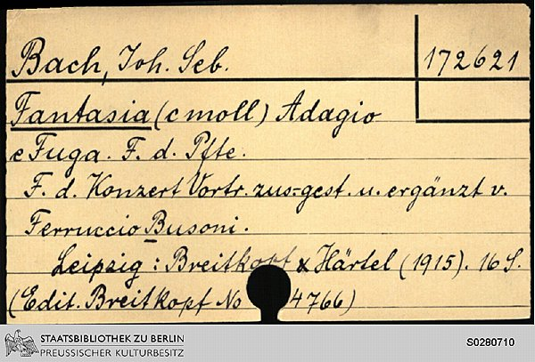
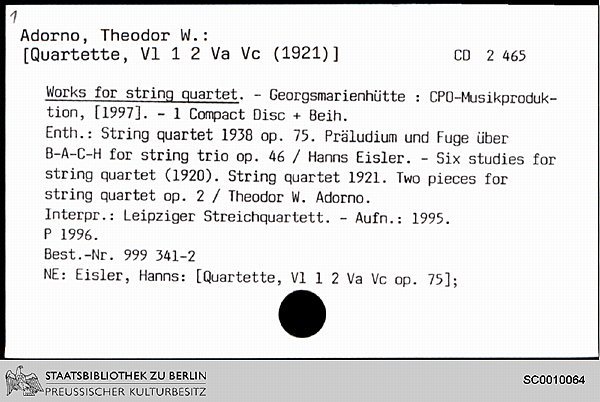

# Datenformat
Die Katalogkarten der Musikabteilung wurden mit einer Aufloesung von 200dpi gescannt und
liegen im TIF-Format vor.

# Katalog 1: Musikbücher und Noten I

* Mix aus Handschriften, Druckschriften (serifenlos) und Schreibmaschinentext (auch auf einer Karte)
* Unterschieldliche Papierfarben, liniertes Papier 
* mehrsprachig

# Katalog 2: Musikbücher und Noten II

* überwiegend maschinengeschriebene Texte
* mehrsprachig (viele diakritisches Zeichen z.B:  ǎ)
* Text kann auf 2 (mehrer?) Karten aufgeteilt sein (Kartennummer meist handschriftlich eingetragen ,
aber Signatur ist auf zusammengehörigen Karten gleich )
* Korrekturen (z.B. SD001/TIF/00000488.tif)
* Unterstreichungen
* Halterungsloch
* Unteschiedliche Schriftarten auf einer Karte

## Kartentypen

* Teilerkarten
* "normale Karten"
* Verweiskarten

## Information

Karteikarten werden seit dem 1800 geführt und unterscheiden sich deshalb stark in ihrer Form. Die Struktur jedoch, sind nach ersten Sichtungen immer gleich. 
Aufgrund der verschiedenen Herkunftsländer, sind die Karten nicht immer in deutscher Sprache verfasst, weshalb eine einsprachige Erfassung zu ungenauen Ergebnissen führen wird.
Karten können weitere Unterkarten besitzen, weshalb die folgekarten bestimmte Informationen nicht enthalten könnten. In vielen Fällen enthalten die Karten dann eine Nummerierung im oberen linken Eckbereich. Als Merkmal kann hier auch die Bildnummer der TIFF-Dateien herangezogen werden, da diese meist chronologisch erfasst wurden.
Die Textform und Schrift variiert, stark nach Zeit und Bibliothekar. So sind viele Karten in Handschrift, Schreibmaschine oder Computertext geschrieben. Vor allem die Handschriftlichen Karten, bieten eine eingeschränkte Qualität, was die Erfassung deutlich erschweren kann. Teilweise wurden Karten auch in Frakturschrift verfasst, weshalb hier unbedingt eine Unterscheidung erfolgen muss

##Aufbau

Alle Karteikarten sind in drei Sektoren aufgeteilt, die unterschiedlich wichtige Informationen beinhalten.

Die obere rechte Ecke, beinhaltet die Signaturnummer, welche aufgrund ihrer Priorität mit 100%ge Genauigkeit erfasst werden muss. Aufgrund der zeitlichen Folge, sind die Signaturnummern nicht immer gleich, weshalb in Signaturen_Tontraeger.pdf alle möglichen Signaturenformate beschrieben sind.

In der oberen Linken Ecke sind immer Informationen zum Verlag, oder dem Autor/Komponisten des Werkes zu finden. Diese Daten können durch externe Quellen validiert werden, um die Genauigkeit und Qualität der Daten zu erhöhen. Als Merkmal ist zu verzeichnen, das die Autoren oft unterstrichen wurden, was in die Erkennung einfließen kann.

Der mittlere Bereich umfasst alle Informationen zu Werken und Einlagerung im Magazin der Staatsbibliothek. Diese sind oft durch Schlüsselwörter markiert, weshalb eine sektorele Erfassung der Daten vorgenommen werden kann.

## Prioritäten
Die Sektoren der Karten sind in folgende Prioritäten unterteilt:
-	Signatur : hohe Priorität
-	Header : mittlere Priorität
-	Text: geringe Priorität

## Metadaten

* Zurodnungen Autor -> Karten bekannt
* Autoren wahrscheinlich bekannt (enthalten in http://www.dnb.de/gnd) 
