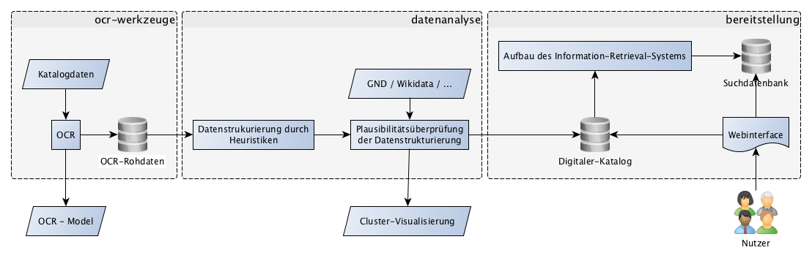

# Konzept

## Vorwort

Im Rahmen des Masterprojektes an der HTW Berlin entsteht in Zusammenarbeit mit der Staatsbibliothek zu Berlin, ein mehrstufiges Forschungsprojekt, im Bereich Texterkennung und Verarbeitung.
Hierfür sollen, die Musikkataloge der Bibliothek, die bisher vor allem aus fotografierten Karteikarten bestehen, umfassend digitalisiert werden.
Das Projekt wird von vier Studenten, Herrn Simon Albrecht, Herrn Jakob Schmolling, Herrn Lars Görisch und Herrn Zellhöfer  als Ansprechpartner für die Staatsbibliothek, geführt.

## Projektumschreibung

Die Staatsbibliothek zu Berlin unterhält ein umfassendes Musikarchiv, mit vielen Werken aus vergangener und heutiger Zeit. Diese werden seit dem Bestehen der Bibliothek auf Karteikarten festgehalten und gesammelt. Der Umfang bemisst sich derzeit auf rund eine Million Karten, die in diesem Projekt in das digitale Archiv und Katalogsystem überführt werden sollen. Aufgrund der Anzahl, wäre eine Digitalisierung durch analoges menschliches Erfassen sehr aufwändig.
Deshalb soll mithilfe von OCR-Software die im TIF-Format vorliegenden gescannten Karteikarten digitalisiert werden. Dafür müssen verschiedene Mechanismen implementiert werden, die die OCR-Ergebnisse überprüfen und validieren können.

## Aufgabenstellung

Kernaufgabe der Anwendung(en) ist die
Gewinnung von strukturierten Daten aus dem Katalog der Musikabteilung.

Diese Daten sollen die Retrokonversion des Katalogs
unterstützen und für Nutzer verfügbar sein.

## Die alphabetischen Imagekataloge der Musikabteilung

Siehe [Datenanalyse](Datenanalyse.md).

## Anwendungsdetails

### OCR
Siehe [Texterkennung](Texterkennung.md).

### Strukturierung und Klassifizierung der Daten
Die Analyse mit OCR-Sofware gibt uns lediglich Aufschluss über den
Textinhalt der Karte. Deswegen wird im nächsten Schritt der
semantische Inhalt der Karten erkannt.

Wortgruppen können mit unterschiedlichen Verfahren klassifiziert werden.
Weiterhin kann die Plausibilität einer Klassifizierung von Wortgruppe mit externen
Datenbanken überprüft werden.

### Visualisierung und Darstellung der Ergebnisse
Eine Retrokonversion darf nur sehr geringe Fehlerraten vorweisen.
Deshalb soll die Anwendung moderne Mittel für die Qualitätskontrolle bereitstellen.
So kann eine Visualisierung von Clustern das Finden von "Ausreißern" erleichtern.

Die entstandenen Daten sollen auch der Öffentlichkeit zugänglich gemacht werden.
Dies erleichtert(/ ermöglicht) das Auffinden von Dokumenten der Musikabteilung.

## Umsetzung

### Texterkennung
Es gibt viele kommerzielle und/oder quelloffene Software für die Texterkennung.
Für den Einsatz in der Anwendung müssen diese Anwendungen evaluiert werden.
Eine korrekte Evaluierung ist nicht einfach,
da viele Methoden mit trainierten Erkennungsmodellen weitaus bessere Erkennungsraten erreichen.

Nicht die Entwicklung sondern die Anpassung von OCR-Methoden stellt hier die eigentliche Arbeit dar.

Quelloffene Software ist in den meisten Fällen nicht nur kostenlos, sondern auch wartbar und anpassbar. Dies ist auch wichtig im wenn die Software bei anderen Retrokonversionensprojekten eingesetzt werden soll.

### Strukturierung und Validierung der Texte
Die Texte werden klassifiziert und nach Entitäten durchsucht.
Eine Klassifizierung (z.B.: nach Medienart, Art des Werkes, ...) soll eine Retrokonversion erleichtern.
Die Klassifizierung von Karten kann auch für die Faceted Navigation genutzt werden.

Die GND wird genutzt um Inhalte zu validieren und zu normalisieren.
Andere Datenbankenquellen werden zur Verbesserung der allgemeinen Quallität eingebunden.
Beispielsweise: Wikidata oder MusicBrainz.

###Externe Datenquellen

Externe Datenquellen bieten ihre Daten in verschiedensten Formaten an, weshalb alle Formate in ein eigenes Datenformat aufgelöst werden müssen, damit diese für das Projekt bereitstehen. Diese sollten optimalerweise in eine Datenbank geschrieben werden um dauerhaft zur Verfügung zu stehen.

## Verarbeitungsprozess
Die Verarbeitung einer einzelnen Karteikarte unterliegt einem mehrstufigen System um die Qualität von Stufe zu Stufe zu erhöhen.
Jeder Prozess muss in einer Datenbank vermerkt werden, um zusätzliche Informationen hinzuzufügen. Dafür sollen alle Stufen ihre spezifischen Merkmale anhängen, um eine evtl. nötige Sichtung möglich zu machen.

#### Stufe 1:
OCR-Erkennung des Textes, optimaler Weise in Sektoren aufgeteilt oder in einer einzelnen .txt Datei.

#### Stufe 2: 
Überprüfung der Signatur mit vorhandenen und bekannten Mustern um Fehlerkennung möglichst auszuschließen. Signaturen die diese Überprüfung nicht bestehen müssen markiert werden.

#### Stufe 3: 
Autoren und Komponisten, die im Headerbreich vermerkt sind können gegen Informationseinheiten validiert werden, um zu prüfen, ob ein Zusammenhang zwischen Erkennung und realen Personen besteht. Sind keine Daten zu finden, soll dies vermerkt werden.

#### Stufe 4: 
Verarbeiten des Textes: Der Text kann Merkmale zu seinen Komponisten und Werksnamen enthalten, sowie verschiedenste Stichpunkte. Diese müssen separiert werden, und können dann ebenfalls gegen externe Quellen validiert werden.

####Stufe 5: 
Aufbereiten der erfassten Daten zur Überprüfung bei nicht bestandenen Validierungen

### Datenhaltung und Server
Eine Umsetzung als Webservice mit Weboberfläche (HTML5, CSS und JS), bereitgestellt durch einen
Java(?)-REST-Server bietet sich aufgrund der Kenntnisse im Team an. 

Alle Daten sollten in einem Datenaustauschformat verfügbar sein.
Dies soll eine Integration in andere Services der Staatsbibliothek erleichtern.

## TODO: Zeitplanung, Milestones, Arbeitspakete

Paket  | Zeit | Kalenderwoche
------------- | ------------- | -------------
OCR implementieren + Dokumentieren  | 2 Wochen | KW: 48 - 50
OCR Training  | 4 Wochen | KW: 50 - 3
Planung Frontend + grobe Implementierung als Prototyp/Mockup  | 1 Woche | KW: 47 - 48
Planung Backend / Service-Infrastruktur  | 2 Wochen | KW: 48 - 50
Abkuerzungen (Instrumente usw) aus PDF in irgendeine DB uebertragen zum Abgleich fuer die OCR-Texte  | 1 Woche | KW: 1
Abgleichs-API zu Wikidata, Abgleichs-API zu MusicBrainz / anderem Service  | 2 Wochen | KW: 1 - 3
Prototypen fuer einzelne Komponenten bzw Vorbereitung REST o.ä. s.o. Zusammenhang  | ... | ...
Vorbereitung Messe 12.2  | 1 - 2 Wochen | KW: 5 - 6

### OCR

Testdaten sind nötig um verschiedene OCR-Systeme zu vergleichen.
Die Erstellung von Trainingsdaten ist ein weitaus größerer Aufwand,
da modernere Verfahren (aus dem Bereich Maschinenlernen) grosse Mengen benötigen. 

### Semantische Analyse

### Datenbank

Vermutlich bietet es sich an, nicht mit klassischen RDBMs sondern eher mit NoSQL-Datenbanken wie MongoDB oder Apache Cassandra zu arbeiten.
Daten zum Abgleich mit bereits bekannten Daten sollten aus Performancegruenden in einem Key-Value-Store wie Redis gehalten werden.

#### TODOS:

* Installieren und evaluieren von MongoDB / Cassandra
* Installation und Evaluation von Redis
* Anbindung der OCR an die oben genannten Systeme
* Anbindung der geplanten Web-Applikation an o.g. Systeme
