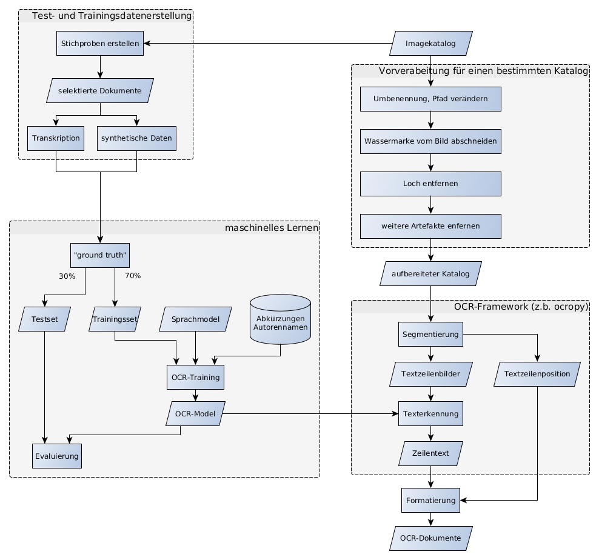

# Texterkennung

## Zielstellung
Anwendung und Anpassung eines OCR-Verfahrens um
eine ausreichend hohe Genauigkeit zu erhalten (> 95%)

## Ergebniss
Textinhalt jeder Karte( und jedes Kartensegments)

## Evaluation 
Abbleich mit korrigierten Daten ("ground truth").

# Probleme

## Datenformat
Formate und Konvetionen können sich je nach Tool unterscheiden.
Ocropy und Tesseract nutzen hOCR: https://de.wikipedia.org/wiki/HOCR_(Standard)
PAGE XML (http://www.primaresearch.org/tools.php)

## Unterschiedliche Dokumenttypen
Eine Kategorisierung der Karten nach verwendeter Schrift wird wahrscheinlich eine wichter
Punkt bei der Texterkennung sein. Im Katalog 2 gibt es zwar nur wenige Schrifttypen, 
aber der Katalog 1 hat Karten mit sehr unterschiedlichen Handschriften und Schreibmaschinenschriften.

## Durchführung

### Vorverarbeitung der Kataloge
Einige OCR-Programme verwenden eine sehr flache Orderstruktur (Buch(Order) -> Seiten (Scans der Seiten).
Deswegen wird der Imagekatalog in diese Form gebracht, dabei wird jedes Bild als PNG gespeichert (~25% des urprünglichen Speicherbedarfs ) und die Fusszeile wird entfernt.
Auf jeder Karte befindet sich ein Loch für die Befästigung im Katalogkasten. Bei der Segementierung enstehen dann Artefakte, welche das trainieren von Modellen erschweren. 
(TODO: Mit Hough-Transformation erkennen und Entfernen)

### Test- und Trainingsdatenerstellung
OCR für alle Karten anwenden
Möglichkeiten um mehr Trainingsdaten zu erhalten:
* Die Arbeit des manuelles Korrigieren und Kategorisieren verteilen (Webapp im Stil von Mechanical Turk?)
* Rechtschreibkontrolle auf Segmenteanwenden und korrekte Segmente als ground truth akzeptieren
* Autoren und Eigennamenerkennen und korrigieren

"ground truth" in einen Git-Repository speichern
csv-Datei für Kartenkategorie
.gt.txt-Datei pro Textzeile oder csv mit allen Segmenten + Text

Die Erzeugung von syntetischen Daten ist auch möglich, da schon ähnliche Datensätze gibt.
Aus Datenbank mit Autoren, Werktiteln und Abkürzungen können auch Textzeilen erzeugt werden.  

Aufteilen der Daten in Trainings- und Testset (70:30 Split)

### Machinelles Lernen
Evaluierne von:
* https://github.com/tesseract-ocr
* https://github.com/tmbdev/ocropy
* https://github.com/tmbdev/clstm
* ...

### Anwendung der OCR auf den Datenbestand
Die Arbeitsschritte der OCR werden über Skripte festgelegt. 
Zusätzlich zum Textinhalt wird die Position jeder Textzeile gespeichert. 
Das Extrahieren der Mediensignatur wird dadürch wesentlich erleichtert (die Signatur ist immer oben rechts auf der Karte). 
Bei der Retrokonversion werden werden die Ergebnisse korrigiert.
Diese können dann wieder in das Trainingsset eingebunden werden.

## Nutzung von Indexierung und mehrteilige Karten

Die Qualität und Quantität des Datensatzes entscheidet oft über den Erfolg beim Einsatz von ML-Verfahren.
Für etwa 30000 Karten liegt der Indextext in maschinenlesbarer Form vor.
Zu jedem Index kann dann die zugehörige Textzeile (als Bild) gefunden werden. 
Dieses Paar aus Trainingsdaten und Label kann dann auch für as Maschinenlernen benutzt werden.

Mehrteilige Karten enstehen wenn die Beschreibung eines Mediums nicht auf eine Karte passt.
Die Erkennung von zusammenhängenden Karten wird Teil des ersten Verarbeitungsschritts.
Alle Karten die ein Medium beschreiben haben den gleichen Index und die gleiche Signatur auf der Karte.
Sprich Folgekarten haben Textzeilen die sich optisch ähneln. Diese Ähnlichkeit stellt wird dann das Kriterum um Gruppen von Karten zu bilden.

## Ergebnisse

Die Ergebnisse befinden sich im Repository [kaphka/catalog-ocr-test](https://github.com/kaphka/catalog-ocr-test) in der Form von Jupyther-Notebooks.
Im späteren Verlauf des Projekts sollen die Arbeitsschritte die in den Notebooks entwickelt werden in einer Python-library umgesetzt werden. 
